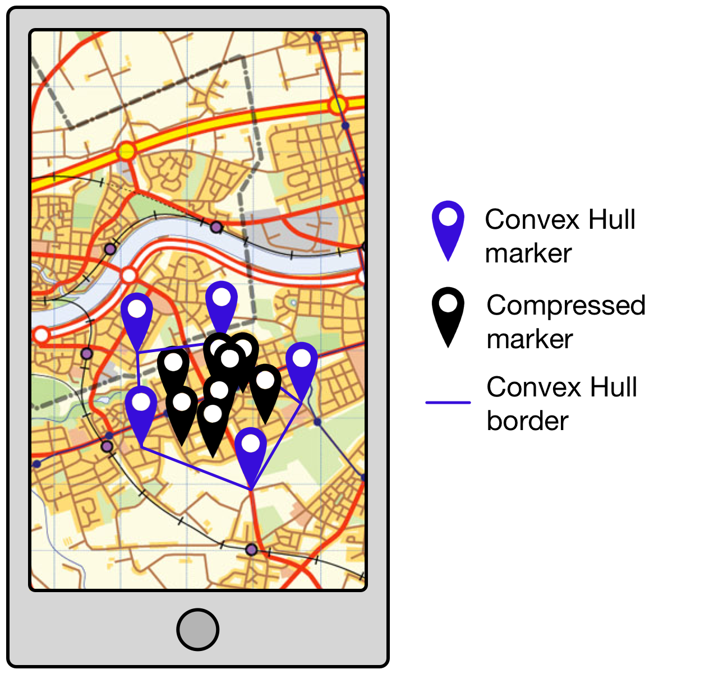
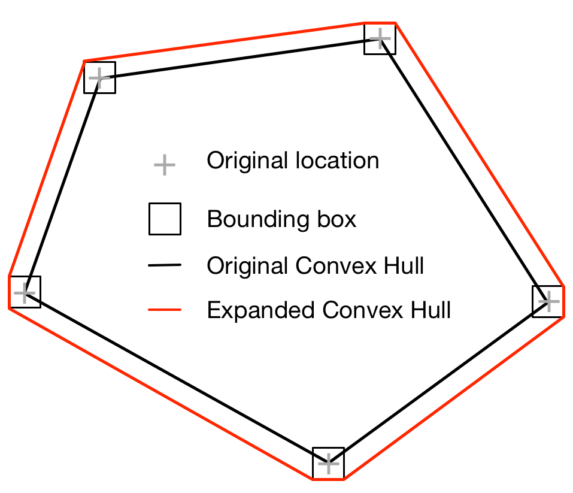

---
category: tech
tags: notes
title: Dynamic Server-Side Clustering for Large Datasets
meta: Recent work for a startup leads to a method for compressing large amounts of location data (100K+ locations) server-side in order to reduce latency and increase performance client-side.
author: Paul Nebel
comments: true
--- 

I recently created a [Minimum Viable Product (MVP)][mvp]{:target="_blank"} for a startup on the [Geovation Programme][GeoProg]{:target="_blank"}. A principal requirement of this MVP is to display geo-located images, and the expectation is that many tens if not hundreds of thousands of images will be available on the site within the first year of operation. This presented me with a difficulty: How do I present such large amounts of data to the user without an unacceptable delay in rendering the results?

This post describes the solution I came up with for clustering images server-side in order to reduce latency and increase performance client-side.

## Client-side Rendering

The client-side rendering of the location data is handled by [Leaflet][leaflet]{:target="_blank"}. My first attempt at compression used a Leaflet plugin called [Marker Cluster][markercluster]{:target="_blank"}. In common with many other clustering libraries, Marker Cluster has a great demonstration showing how well it renders a large number of markers ([50,000][50k]{:target="_blank"} in this case). What is fails to do (also in common with the other libraries) is to explain how you get 50,000 markers onto the client in the first place without waiting 5 minutes for them to be transferred from the server. This is the problem I aim to solve.

In order for the server-side results to be compatible with the client I decided that the same clustering algorithm should be used on both platforms. Since MarkerCluster is DOM-based, this meant creating a virtual DOM on the server and somehow running the MarkerCluster library within it. To cut a long story short, I managed to make this work by modifying [this][markerclusterserver]{:target="_blank"} excellent example but it quickly became apparent that even with low numbers (i.e. 2000 - 3000 markers) performance was unacceptably slow.

It was at this point that I discovered the excellent [Supercluster][supercluster]{:target="_blank"} library from [Mapbox][mapbox]{:target="_blank"}. The [algorithm][superclusteralgorithm]{:target="_blank"} used by Supercluster results in:

> A crazy fast geospatial point clustering library for browsers and Node

Given that the API for this project is written in [Node][nodejs]{:target="_blank"} this seemed to be the perfect solution.

## Server-side Compression

[ElasticSearch][elastic]{:target="_blank"} is used within the MVP to index selected elements of the metadata associated with each image for fast retrieval.  This includes both text data (in the form of tags and keywords) and location data. ElasticSearch has the capability to perform a range of [Geo-related queries][elasticgeo]{:target="_blank"} including **geo_polygon** searches to find documents with geo-points within a specified polygon.  This is perfect for compressing the source data using the technique described below.

### Compresion Based on Current View

When viewing the MVP app on the web or via a mobile device the user is usually only looking at a small part of the available map.  The first step in compressing the result set is, fairly obviously, to only return those images whose location falls within the area viewed on the device screen.  However, even this is not as straightforward as it seems.  In fact, if we are to avoid an unsettling user experience we need to return all images located within a boundary at least 9 times larger than the visible screen (see Figure 1 below).

|  |
|:--:|
| **Figure 1: Screen-based retrieval bounds** |

The area we want to view is the rectangle 5 in Figure 1. If the user were to drag the map from the top right-hand corner to the bottom left-hand corner, say, then rectangle 3 would become visible. If we haven't returned the results for rectangle 3 when rendering rectangle 5 the user is going to see clusters and individual images appearing incrementally as they drag and drop the map.  This is a horribly disorientating experience.  By pre-fetching all the images located 'one screen' in all adjacent directions we stop this from happening, at the cost of having to return roughly an order of magnitude more points than we would get for a 'single-screen' search.

The clustering service is run whenever dragging has stopped, but since the new images being returned lie outside the visible area this shouldn't upset the user unduly.  This is all well and good, but there is a severe limitation to this method, which is that it makes no use of client-side caching.  The four points representing the 'corners' of the retrieval bounds are sent to the API as a query string meaning that almost every time the view is moved a new query string will be created, negating the caching ability of the client.

### Client-side Caching

The API query string is constructed by converting the latitude/longitude values of the retrieval bounds to [geohashes][geohash]{:target="_blank"}.  A geohash is a convenient, compressed way of representing a location. The greater the precision of the geohash, the smaller the area it represents.  Thus, we can compress two 12-digit numbers (the latitude and longitude) into a single 12-digit geohash which approximates to a cell 37.2mm wide by 18.6mm high.  Although this conversion isn't exact, it's close enough for our purposes and represents a 50% reduction in payload to and from the server (the location results from the API are also returned as geohashes). This, in itself, does not help with client-side caching.

Most web-based mapping services use [slippy maps][slippymap]{:target="_blank"} that render [map tiles][maptiles]{:target="_blank"}. If [we use the map tiles][maptilecalcs]{:target="_blank"} which contain the screen-based retrieval bounds as the co-ordinates for the API query string we introduce an element of repeatability and, therefore, cachability to our queries (see **Figure 2** below). Many screen-based retrieval queries will be represented by a single combination of tile-based retrieval bounds, facilitating caching at the expense of returning more locations that we need for any given screen view. It is a price worth paying.

|  |
|:--:|
| **Figure 2: Map Tile-based retrieval bounds** |

### Introducing Convex Hulls

So far I haven't done very well at compressing the results returned from the API. Instead, I've managed to increase the number of images being returned by close to an order of magnitude. However, the justification for this is an improved user experience.  Now I need to introduce some significant compression to make up for this cost.

It's time to introduce the [Convex Hull][convexhull]{:target="_blank"}. ElasticSearch returns all the images located within the tile-based retrieval bounds.  This collection of locations is passed to supercluster which groups them into clusters based on the dimensions (in pixels), zoom level (maximum, minimum and current), device pixel ratio and maximum cluster radius of the client. Now that we know which images are grouped together we can introduce a significant level of compression by returning only the points comprising the convex hull of each cluster (see **Figure 3** below).

|  |
|:--:|
| **Figure 3: Convex Hull compression** |

Using the convex hull to represent a cluster significantly reduces the number of images returned at low zoom levels where more of the map is visible. In fact, at the zoom level showing the entire UK compression reaches close to **99%**. This means that instead of returning, say, 100,000 image locations we're only returning approximately 2,000 image locations which is perfectly acceptable in terms of network and rendering latency.

Conversely, at high zoom levels where more detail is observed we actually return many times more image locations than are visible.  However, the number of image locations visible at high zoom levels is small so this is not actually an issue.

Supercluster iteslf does not return the convex hulls of the clusters, so I've used [another library][geoconvexhull]{:target="_blank"} to calculate convex hulls server-side.

There is an additional advantage to representing clusters by their convex hull, which is that when a user clicks on a cluster in the map they are shown a carousel containing the images contained within the cluster. An array of geohashes calcualted from the convex hull for the cluster that has been clicked on is sent to the API and used to define the geo polygon sent to ElasticSearch.

There are a couple of practical difficulties with this, however.  Firstly, the closer a user zooms into the map the more likely it is that she will see clusters comprised of only 2 image locations.  Unfortunately, two points constitutes a line, not a polygon.  Secondly, due to small rounding errors when converting to geohashes and the tolerance applied to the ElasticSearch geo_polygon queries it was often the case that the polygon representing the convex hull did not return all the image locations known to be contained within a given cluster.

In order to account for this I needed to make the convex hull very slightly bigger. I did this by using Leaflet to [convert each point in the convex hull into it's equivalent bounding box][leaflettobounds]{:target="_blank"} (with a width and height of 1m). I calculated a new convex hull in the client based on these bounding boxes and returned this convex hull to the API as the limits of the search (see **Figure 4** below). This proved to be very effective, even for convex hulls comprised of two points (as using the bounding boxes of each point automatically converted them into a polygon).

|  |
|:--:|
| **Figure 4: Expanded Convex Hull to account for conversion errors** |

At lower zoom levels convex hulls often overlap, meaning that some points are ambiguous as to which cluster they appear in.  When clicking on a cluster to display its carousel it is sometimes the case that more images are contained in the carousel than are indicated by the cluster marker. There isn't much we can do about this as it is a consequence of the clustering algorithm iteslf. It's usually only a couple of extra points which is an acceptable margin of error (even Google sometimes shows discrepencies between the number of expected and actual results!).

### Data Definitions

The search results from the API are returned as JSON in the following format:

```
{
  clusters: [ 
    {
      center: 'gcnenky4wfrg',
      count: 8,
      convexHull: [
        'gcnenky4wfrg',
        'gcnenky4qsft'
      ]
    },
    ... more clusters ...
  ],
  markers: [
    {
      id: <UUID of location object in database>,
      <other domain-specific location properties>
      loc: 'gcw2nuqy8q7b'
    },
    ... more markers ...
  ]
}
```

There are two arrays in the result object, `clusters` and `markers`.  The `clusters` represent the output from supercluster, while the `markers` represent image locations that do not belong to a cluster. These results are mapped to [GeoJSON][geojson]{:target="_blank"} in the client as follows:

```
const cluster = {
  geometry: {
    type: "Point",
      coordinates: [
        <cluster center longitude from geohash>,
        <cluster center latiitude from geohash>
      ],
  },
  properties: {
    cluster: true,
    point_count: <count from cluster>,
    convexHull: [
      <array of lat/long converted from cluster convex hull geohashes>
    ],
  },
	type: "Feature",
};

const marker = {
  geometry: {
    coordinates: [
      <marker location longitude from geohash>,
      <marker location latiitude from geohash>
    ],
    type: "Point",
  },
  properties: {
    <other properties derived from domain-specific location properties>,
  },
  type: "Feature",
};
```

GeoJSON is a format understood by Leaflet, meaning that no further conversion is necessary to display the locations on the client map. The justification for using a bespoke JSON format for the API results which is then converted to GeoJSON is to reduce the size of the response payload as much as possible.  The latency introduced by converting the results in the client is insignificant.

The supercluster algorithm is such that you get different clusters depending upon the order in which you add locations to the cluster group. For this reason, results from ElasticSearch are sorted by UUID to ensure consistency.  However, this does not appear to ensure consistency between server- and client-side clusters. I originally tried to create client-side clusters using the convex hulls returned from the API but the results I got didn't match the server-side clusters.

This is because the algorithm for creating clusters is not only dependent upon order in which points are added to the map but also, fairly naturally, on the location of those points; our reduced set of results is in the same nominal order but in effect the locations are now jumbled up so we get a different result!

Instead of relying on client-side clustering to render the locations for us we need to return a single point representing the centre of the cluster and an associated array of points that are the convex hull locations of the images for that cluster. Client-side clusters are then calculated from the center point of each cluster, which produces clusters that match those calculated server-side. However, each cluster now consists of only one point, so I had to override the cluster icon to display the count of points in the cluster and the mouse hover function to display the convex hull as a polygon.  

Given that each cluster now contains only a single point you may be asking why I bothered using supercluster client-side at all.  The answer is that the authors of supercluster have already done the work required to ensure that the cluster icon displays consistently in all devices and browsers, removing an unnecessary overhead from my work.

Also, supercluster helps provide a smoother experience when zooming out. This is because the map is not re-rendered until the zoom is completed but supercluster knows how to aggregate clusters at each zoom level. By adding together the count property of all child clusters at the next zoom level up we can display an approximation to the total number of locations in the clusters at the new zoom level.  These approximations may not be the same as the final count on re-rendering, but the results are close enough to result in a smoother user experience.

### Performance

As mentioned above, for 100,000 dummy data points at the lowest zoom level I achieved compression levels of greater than 98%.  Unexpectedly, the limiting performance factor at these zoom levels is not the clustering algorithm but ElasticSearch. The maximum page size in ElasticSearch is 10,000 results, meaning that we have to retrieve 10 pages of data at lowest zoom. This introduces significant latency (approximately 4 seconds for 100,000 points). It is good to know that 100,000 points can be handled but this level of latency is not acceptable, so we need a method of paging data when we get close to this number of results.

I'll solve that problem when I get to it.

[mvp]: <https://blog.crisp.se/2016/01/25/henrikkniberg/making-sense-of-mvp>
[GeoProg]: <https://geovation.uk/programme/>
[leaflet]: <http://leafletjs.com/>
[markercluster]: <https://github.com/Leaflet/Leaflet.markercluster>
[50k]: <https://leaflet.github.io/Leaflet.markercluster/example/marker-clustering-realworld.50000.html>
[markerclusterserver]: <https://github.com/pimterry/leaflet-map-server-component>
[supercluster]: <https://github.com/mapbox/supercluster>
[mapbox]: <https://www.mapbox.com/>
[superclusteralgorithm]: <https://blog.mapbox.com/clustering-millions-of-points-on-a-map-with-supercluster-272046ec5c97>
[nodejs]: <https://nodejs.org/en/>
[elastic]: <https://www.elastic.co/>
[elasticgeo]: <https://www.elastic.co/guide/en/elasticsearch/reference/5.1/geo-queries.html>
[convexhull]: <https://brilliant.org/wiki/convex-hull/>
[geohash]: <http://www.movable-type.co.uk/scripts/geohash.html>
[slippymap]: <https://wiki.openstreetmap.org/wiki/Slippy_Map>
[maptiles]: <https://en.wikipedia.org/wiki/Tiled_web_map>
[maptilecalcs]: <https://wiki.openstreetmap.org/wiki/Slippy_map_tilenames#ECMAScript_.28JavaScript.2FActionScript.2C_etc..29>
[geoconvexhull]: <https://github.com/andrewkfiedler/geo-convex-hull>
[leaflettobounds]: <http://leafletjs.com/reference-1.3.0.html#latlng-tobounds>
[geojson]: <http://geojson.org/>