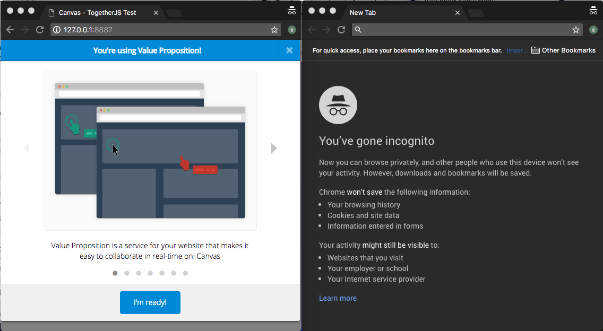
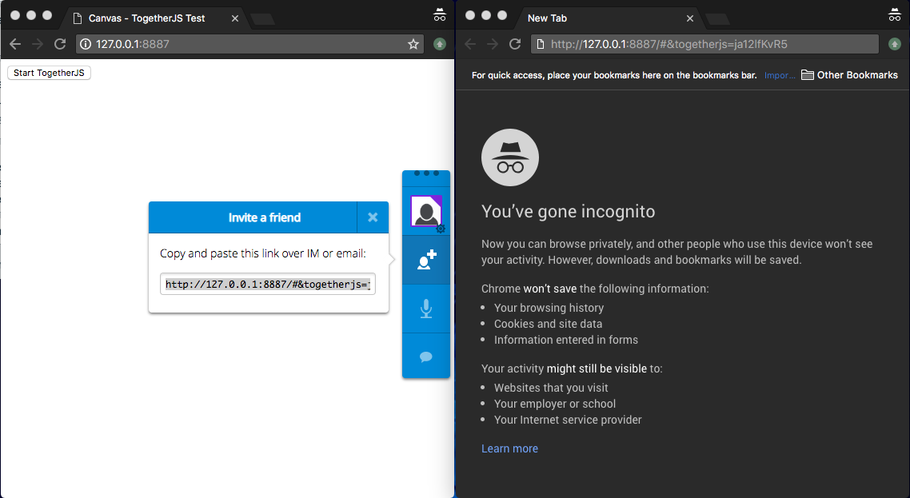
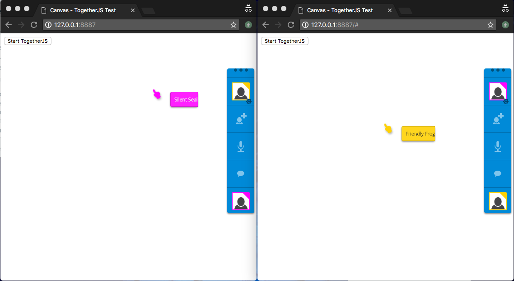
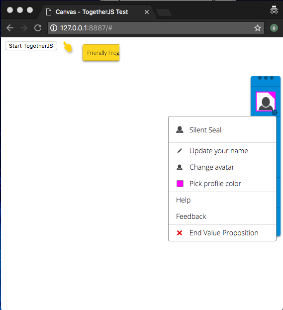
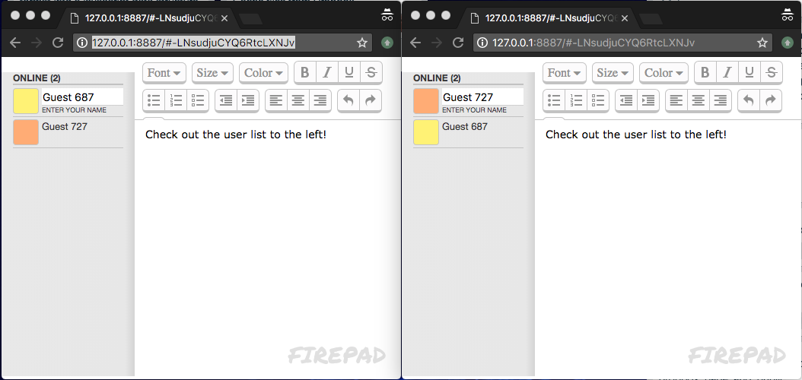
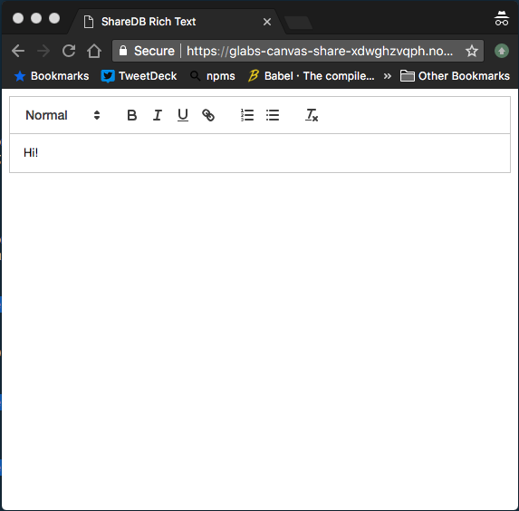

One of the first tools that we use to help the startups on the [Geovation Accelerator Programme][geoprog]{:target="_blank"} is [Value Proposition Design][valueprop]{:target="_blank"}.  This tool requires the use of the [Value Proposition Canvas][valuepropcanv]{:target="_blank"} as a mechanism for understanding how closely a product or service satisfies the needs of potential customers. This usually involves a large whiteboard and a stack of sticky notes to complete the task.

As a team we want to better understand how to serve our startups. One of the best ways of knowing how well your product or service is working is to [eat your own dogfood][dogfooding]{:target="_blank"}. With this in mind we instigated a team project to create a product similar to [appear.in][appearin]{:target="_blank"} that allows participants to collaborate on the creation of a Value Proposition Canvas. In doing this we will adopt a startup mindset in order to better understand how well our processes support the members of our accelerator programme.

The aims of this project are:

 - To upskill on technologies and approaches we think will benefit our startups
 - Increase our familiarity with the range and capabilities of comoditised tools available for zero cost
 - Share all of our output as blog posts or open source projects for the benefit of our community
 - Hone our own best practice as an engineering team

In creating this product we intend to assemble the most basic set of outputs that a startup might require, as follows:

 - A prototype of our Unique Selling Point (in this case a collaborative Value Proposition Canvas tool)
 - A marketing site to tell people about the product
 - An associated iOS and Android app
 - The ability to:
    * Track user behaviour
    * Allow people to pay for the product
    * Allow people who have paid to access a private version of the product
  
To this end, we are imposing the following constraints on ourselves with respect to completion of this project:

 - The project must not incur any costs whatsoever (other than our own time). We are not allowed to spend any money unless there is absolutely no alternative.
 - We must not build anything that already exists for free, preferably as an open-source version.

The first step in creating our prototype is to find a mechanism that allows participants on different clients (browsers, mobile devices etc.) to collaborate on a common online document.  This blog describes 3 potential open-source tools ([TogetherJS](#togetherjs), [Firepad](#firepad) and [ShareDB](#sharedb)) that we might use to this end.

### Operational Transformations

In order for users on different clients to collaborate on online documents we require a mechanism which understands and respects each change made by every user in such a way that these changes can overlap seamlessly without contradicting one another.  The solution commonly used to achieve such a mechanism is [Operational Transformation (OT)][optrans]{:target="_blank"}, as popularised by Google.

For example, suppose that we have two users, UserA and UserB, collaborating on the same document from different laptops.  Suppose further that the document currently contains the text `Hello world`. Imagine that UserA wants to change the message to `Hello World` at the same time as UserB wants to change the message to `hello world`. Imagine further that both users make their changes by first deleting the appropriate character before adding a new one.

UserA's editor may dispatch a message something like `delete(6)` followed by `insert('W', 6)`

UserB's editor may dispatch a message something like `delete(0)` followed by `insert('h', 0)`

Finally, suppose UserA and UserB are both typing at the same time such that these messages get delivered to the server in the following order:

```
delete(0)        // UserB's first keystroke
delete(6)        // UserA's first keystroke
insert('W', 6)   // UserA's second keystroke
insert('h', 0)   // UserB's second keystroke
```

Without OT, the document would now display the text `hello wWrld`. This is because the first operation deletes one character at position 0 in the string (i.e. the character `H` at the start of the string). The second operation, intended to delete the `W` at the start of the word `World` is now broken because the entire string has, in effect, shifted one place to the left on deletion of the first character.  Unfortunately, however, network and processing latency is such that this initial change on client B has not yet been propogated to client A.  Thus, instead of deleting the `W` at the start of `World` we actually end up deleting the `o` to the right of it.  The next operation now inserts the character `W` in the *wrong* position before the final operation which adds the character `h` to the start of the string.  Hence, `hello wWrld`.

If we had used OT, we would have ended up with the string `hello World`. This is not what either user individually intended but it is the *correct* result of applying both changes (no-one said collaborative editing was easy!). This is becuase OT recognises that the each operation potentially has an effect on every subsequent operation and adjusts those subsequent operations accordingly before returning the result to each users client. For more details on how OT actually achieves this see Daniel Spiewak’s excellent article [Understanding and Applying Operational Transformation][applyot].

All 3 of the options discussed below implement collaboration using OT.

## TogetherJS

[TogetherJS][togetherjs]{:target="_blank"} was created and is hosted by [Mozilla][mozilla]{:target="_blank"}.  The functionality of TogetherJS is based around what they call the *hub*: a server that everyone in the session connects to which echoes messages to all the participants using WebSockets.  Although [ShareDB](#sharedb) also requires a co-ordinating server, the main differentiator of TogetherJS's solution is that the *hub* doesn't do anything much other than pass messages between participating clients.

TogetherJS offers a hosted *hub* for use by clients, but it is possible to host a *hub* of your own (although the TogetherJS team admits that self-hosting is not yet "finished" and details are likely to change).

All of TogetherJS's features are based on these messages and work directly with the DOM via the script embedded in the client page. As a consequence, TogetherJS is configured in the client using a [range of available options][togetherjsoptions]{:target="_blank"}.

TogetherJS is very simple to install, simply add the following JavaScript snippet:

```<script src="https://togetherjs.com/togetherjs-min.js"></script>```

To start running TogetherJS in you application, paste the following anywhere in your site:

```<button onclick="TogetherJS(this); return false;">Start TogetherJS</button>```

With only these two commands it is possible to create a shared session (albeit one that doesn't do anything other than display the location of the other participants' cursor) as shown in the figures below.  Clicking on the `Start TogetherJS` button opens a modal (see **Figure 1**): 

|  |
|:--:|
| **Figure 1: TogetherJS - Starting a session** |

Clicking the `I'm ready` button on the modal initiates the session.  Participants are invited via a URL which can be distributed by instant message or over email (see **Figure 2** below):

|  |
|:--:|
| **Figure 2: TogetherJS - Inviting participants** |

Participants navigating to this URL are invited to join the session, and become visible in other participants' browser windows (there is a nice animation associated with other participants' cursors which is not visible in **Figure 3**):

|  |
|:--:|
| **Figure 3: TogetherJS - Sharing a session** |

TogetherJS can connect to a participants microphone to provide audio chat over [WebRTC][webrtc]{:target="_blank"} or, alternatively, launch a chat window for text-based discussion. It also allows for user settings to be controlled including the avatar representing the user, name, and color (used to animate an indicator showing where the user is currently focussed on the screen) as shown in **Figure 4** below:

|  |
|:--:|
| **Figure 4: TogetherJS - User settings** |

This example in no way exercises all the capabilities of TogetherJS but it does give us an insight into what it possible.

Of the three options considered here, TogetherJS is the most product-like solution, offering a wide range of functionality (wider than we need for what we are trying to achieve in this project). Despite this, or perhaps because of it, TogetherJS doesn't feel production ready yet. It is for this reason that we did not choose TogetherJS although we will be keeping a close watch on its development.


## Firepad

[Firepad][firepad]{:target="_blank"} is part of the [Firebase][firebase]{:target="_blank"} suite owned by Google.  Unlike either [TogetherJS](#togetherjs) or [ShareDB](#sharedb), Firepad doesn't require a co-ordinating server. Instead, however, it requires an instance of [Firebase Realtime Database][firebasedb]{:target="_blank"} to enable data synchronisation. This has the advantage of making it easy to add Firepad to any application, even static websites. In addition to this, Firepad can be run in Headless mode (i.e. without a GUI) using [Node.js][nodejs]{:target="_blank"}. When operating in normal mode Firepad uses either [CodeMirror][codemirror]{:target="_blank"} or [Ace][ace]{:target="_blank"} as the text editor.

Firepad is only slightly more complex to install than TogetherJS.  According to the documentation it is simply a case of adding the following to your site and you're ready to go:

```javascript
var firepadDiv = document.getElementById('firepad');
var firepadRef = firebase.database().ref();
var codeMirror = CodeMirror(firepadDiv, { lineWrapping: true });
var firepad = Firepad.fromCodeMirror(firepadRef, codeMirror,
	{ richTextShortcuts: true, richTextToolbar: true });
```

It's actually more than this since you need a Firebase Realtime Database instance to persist the state of your app.  You can open a Firebase account and create a Realtime Database instance for free. Once created, it is necessary to add the associated config to your site similar to the following:

```javascript
var config = {
	apiKey: '<API_KEY>',
	authDomain: '<DATABASE_NAME>.firebaseapp.com',
	databaseURL: 'https://<DATABASE_NAME>.firebaseio.com'
};
```

Participants can join the session by navigating to the shared URL, as shown in **Figure 5** below:

|  |
|:--:|
| **Figure 5: Firepad - Sharing a session** |

Creating a Firepad app is very easy to do but it has the disadvantage of making you dependant upon Firebase.  This is not much of a disadvantage in reality but it is an option we did not want to consider for the purposes of this task simply because we wanted to be able to host as much of the solution ourselves without being dependant upon third-party providers.  It also means that the Firebase configuration either has to be included in the front-end code (a potential security risk) or hidden behind an API (requiring additional effort).

## ShareDB

[ShareDB][sharedb]{:target="_blank"} is a realtime database backend supporting OT, in complete contrast to Firepad and TogetherJS. Participants are connected using WebSockets just like TogetherJS. The default implementation of ShareDB is an in-memory, non-persistent database with no queries.  It is possible, however, to create connectors for other databases and connectors are provided for [MongoDB][mongodb]{:target="_blank"} and [Postgres][postgres]{:target="_blank"}.

ShareDB is horizontally scalable using a [publish and subscribe][pubsub]{:target="_blank"} mechanism, making it relatively future-proof. Since it uses [Express][express]{:target="_blank"} for the server it is possible to use [middleware][middleware]{:target="_blank"} to hook into the server pipeline and modify objects as they pass through ShareDB, adding flexibility.

Unlike the previous tools, ShareDB requires more code to set up (but there are several [examples][sharedbexamples]{:target="_blank"} to use as a starting point). The shared session shown in **Figure 6** below uses the [rich-text example][sharedbrichtext]{:target="_blank"}.

|  |
|:--:|
| **Figure 6: ShareDB - Sharing a session** |

ShareDB doesn't have some of the extended features of TogetherJS or Firepad. The examples shown here of TogetherJS and Firepad both have the capability to see which users are participating whereas ShareDB does not. In the case of TogetherJS no extra code was required to achieve this.  Firepad required some considerable extra code but [an example was available for this][firepadusers]{:target="_blank"}. It would be possible to provide this capability if required. Fortunately, we don't need this extra functionality for this project.

The default in-memory configuration of ShareDB is perfectly adequate for what we are trying to do and doesn't require any additional servers or services to persist the results (although we can add these when necessary). It also facilitates easy unit testing. In addition, the [Quill][quill]{:target="_blank"} rich text editor interface provided in the examples is clean and simple which we percieve as an advantage. The server is implemented in Express which is familiar technology to our team.

## Conclusion

Both TogetherJS and Firepad offer greater functionality than ShareDB but this comes at what we consider to be a cost for this project.  TogetherJS is not production-ready and Firepad ties the implementation into a third party.  Neither of these options fit with our requirements.

As a consequence, we chose ShareDB for this project. This does not mean it is a 'better' solution than either TogetherJS or Firepad, simply that it is a better fit for our project.

[geoprog]: <https://geovation.uk/programme/>
[valueprop]: <https://strategyzer.com/training/courses/mastering-value-propositions>
[valuepropcanv]: <https://strategyzer.com/canvas/value-proposition-canvas>
[dogfooding]: <https://en.wikipedia.org/wiki/Eating_your_own_dog_food>
[appearin]: <https://appear.in/>
[optrans]: <https://operational-transformation.github.io/>
[togetherjs]: <https://togetherjs.com/>
[firepad]: <https://firepad.io/>
[firebasedb]: <https://firebase.google.com/docs/database/>
[sharedb]: <https://github.com/share/sharedb>
[applyot]: <http://www.codecommit.com/blog/java/understanding-and-applying-operational-transformation>
[mozilla]: <https://www.mozilla.org/>
[webrtc]: <https://webrtc.org/>
[togetherjsoptions]: <https://togetherjs.com/docs/#configuring-togetherjs>
[firebase]: <https://firebase.google.com/>
[nodejs]: <https://nodejs.org/en/>
[codemirror]: <https://codemirror.net/>
[ace]: <https://ace.c9.io/>
[mongodb]: <https://www.mongodb.com/>
[postgres]:https://www.postgresql.org/>
[quill]: <https://quilljs.com/>
[express]: <https://expressjs.com/>
[sharedbexamples]: <https://github.com/share/sharedb/tree/master/examples>
[sharedbrichtext]: <https://github.com/share/sharedb/tree/master/examples/rich-text>
[firepadusers]: <https://github.com/FirebaseExtended/firepad/blob/master/examples/userlist.html>
[pubsub]: <https://en.wikipedia.org/wiki/Publish%E2%80%93subscribe_pattern>
[middleware]: <https://expressjs.com/en/guide/using-middleware.html>


