# Introduction

Whether you are a seasoned QGIS user or new to the whole world of GIS: You have probably more than once applied a repetitive row of manipulations to your data until you've received the final results. Then when you get a new dataset and want to apply the same logic: Same procedure. This is not only time-consuming but also prone to errors, you might set some parameters slightly different without noticing for example and compare pears with apples.

Luckily QGIS comes with a nice tool to help you in these cases. I have only really started using it recently and it is by no means perfect (more on this in the [pitfalls section](#pitfalls-and-alternatives) at the bottom). But it is great for what it is built for in my opinion: Repetitive, even complex processing flows, with not too complex and big data inputs.

In this post I will walk through the features of the processing modeler using an example scenario. Towards the end I will discuss potential pitfalls of the tool as well as alternatives.

# Tutorial structure

<!-- TOC depthFrom:1 depthTo:6 withLinks:1 updateOnSave:0 orderedList:0 -->

- [Prerequisites for this tutorial](#prerequisites-for-this-tutorial)
- [Scenario](#scenario)
	- [Administrative areas](#administrative-areas)
	- [Population data](#population-data)
- [Getting started with the processing modeler](#getting-started-with-the-processing-modeler)
- [Let's get processing](#lets-get-processing)
	- [Creating your inputs](#creating-your-inputs)
		- [1. Population Data Raster](#1-population-data-raster)
		- [2. Administrative Areas Vector data](#2-administrative-areas-vector-data)
	- [Adding processing steps](#adding-processing-steps)
		- [Calculating population per region](#calculating-population-per-region)
		- [Normalising the population count](#normalising-the-population-count)
			- [Adding the geometry attributes](#adding-the-geometry-attributes)
			- [Calculating the population density](#calculating-the-population-density)
	- [Storing your model](#storing-your-model)
	- [Running your model](#running-your-model)
- [Pitfalls and alternatives](#pitfalls-and-alternatives)
	- [Lack of documentation](#lack-of-documentation)
	- [Processing speed](#processing-speed)
	- [Alternatives](#alternatives)
- [Summary](#summary)

<!-- /TOC -->
# Prerequisites for this tutorial

- You need to have a working version of QGIS (preferably 3.x) installed
- You should have some familiarity with how to load and inspect data in QGIS

# Scenario

As a scenario I would like to calculate the population density per region in Tanzania. For this I need the following data input.

Data type  | Source |  Weblink
--|---|--
Population data  | Facebook Open Population Dataset  | [Data Download](http://www.ciesin.columbia.edu/repository/hrsl/hrsl_tza_v1.zip) ([Facebook Blog Post about Open Population Datasets](https://code.fb.com/connectivity/open-population-datasets-and-open-challenges/) )
Administrative boundaries: Regions of Tanzania  |  OpenStreetMap level 4 administrative boundaries, extracted using the Overpass API. Saved as GeoJSON   |  [Permalink to Overpass Turbo query](http://overpass-turbo.eu/s/Eue)

You can load these two datasets into QGIS to inspect them.

## Administrative areas

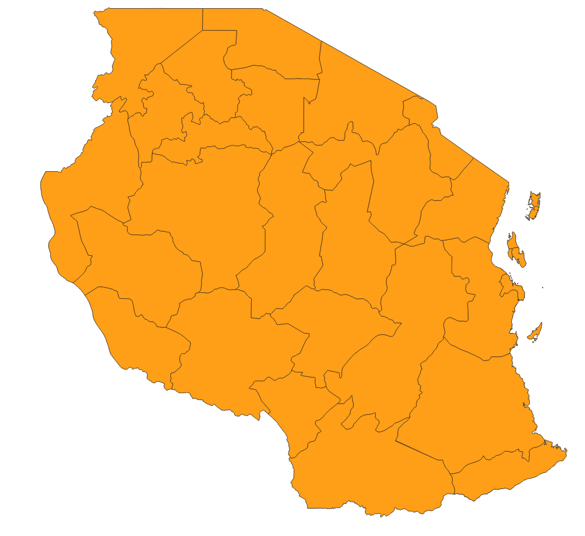

There will be two layers in the boundaries geojson, one with points, one with polygons. We will have export the polygon to a new layer by _right-clicking on the layer_ and then _Export_ > _Save Feature as_. You can pick a format of your choice and make sure to leave _Add save file to map_ checked.

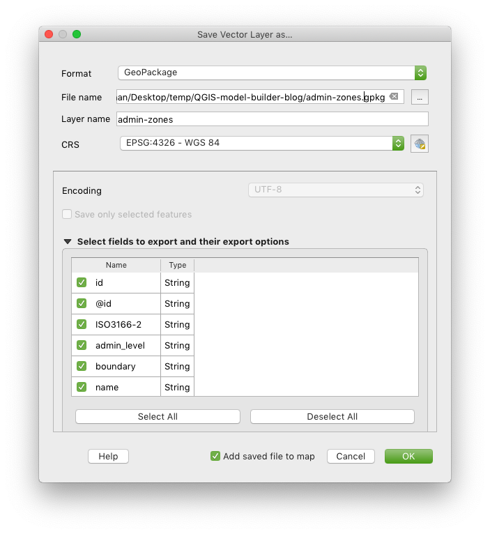

This step is required because otherwise when working directly on the GeoJSON the projection doesn't seem to be picked up correctly and hence the process fails to calculate the numbers.

## Population data

Extract the zip file for Tanzania that you have downloaded from the Columbia University page. Now load the population data GeoTIFF into QGIS (hrsl_tza_pop.tif). Your map should now look like below.

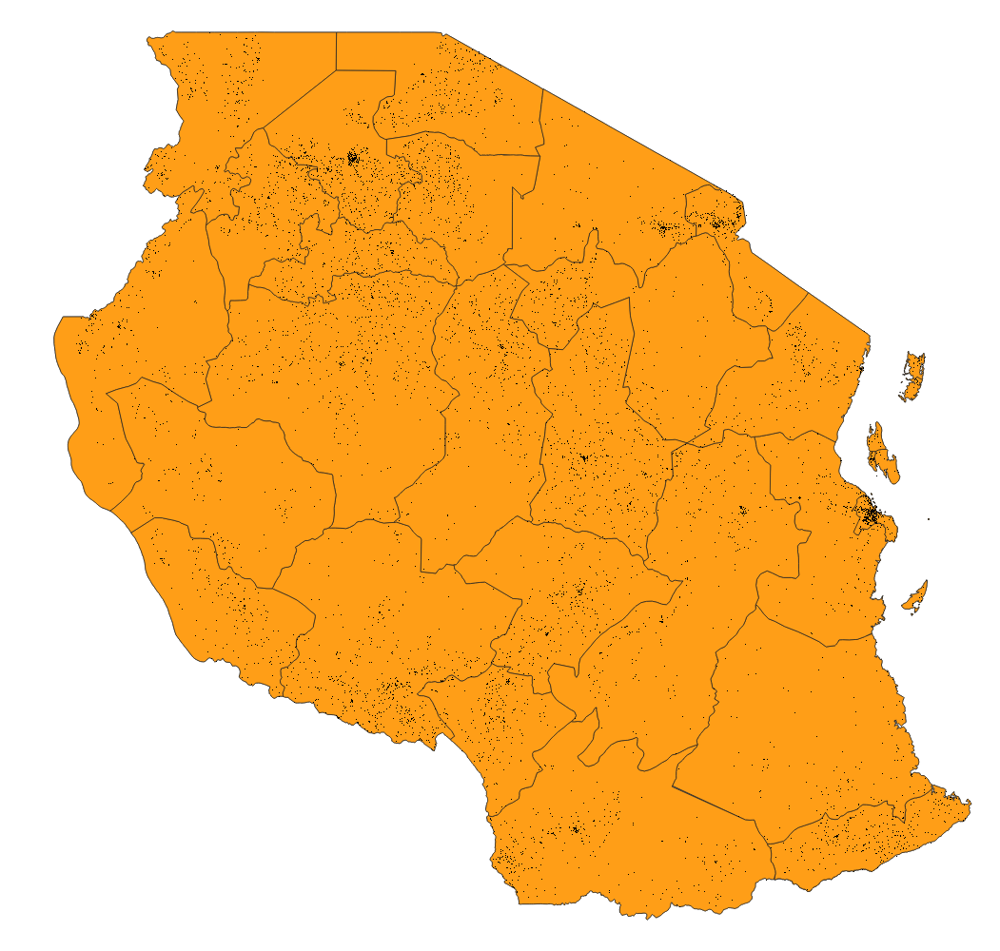

# Getting started with the processing modeler

You can access the Graphical Modeler or Processing Modeler through the Menu under _Processing_ > _Graphical Modeler_.

In the left hand column you'll find a window with possible *input* types into the model. This could be simple values such as text or numbers, or also layers and files. In the second tab of the column, named *algorithms* you can find the tools you can use to manipulate the data. If you've used the toolbox of QGIS before they will be familiar to you.

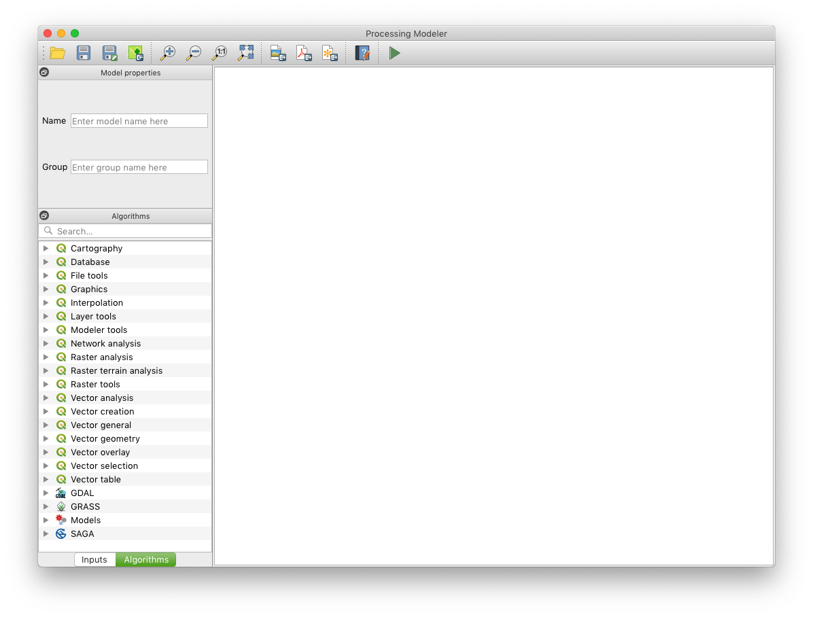

The white main space, let's call it workspace, is where you compose your model. Usually you would start with some inputs, define what you want to do with the input, and then save it as one or multiple outputs.

# Let's get processing

As you can imagine, given the scenario, we need the following two inputs:

- Raster: Population data
- Vector polygons: Administrative areas

Before we define these inputs let's quickly look into how they work. All inputs will later on create a form field that you will be asked to fill in before running the model. So say you add a file input, then you'll be able to select which file you want to use for this input. Or if you have a number input you'll be asked to enter a number. Or in case of a layer input, you'll be able to select from the layers that are added to your QGIS map currently. It's therefore important that you give your inputs meaningful names so that you later on know what they're actually for (a generic 'vector layer 1' won't help you much).

## Creating your inputs

### 1. Population Data Raster

You will need the population raster data as the first input. Move the 'Raster layer' input into the workspace (or double click it), and name it 'Population_count' for example

### 2. Administrative Areas Vector data

The second input are the administrative areas. Create a Vector Layer input and name it 'Administrative_areas' for example. Also select 'Polygon' as Geometry Type.

Your workspace should now look like this (unless you named your inputs differently)

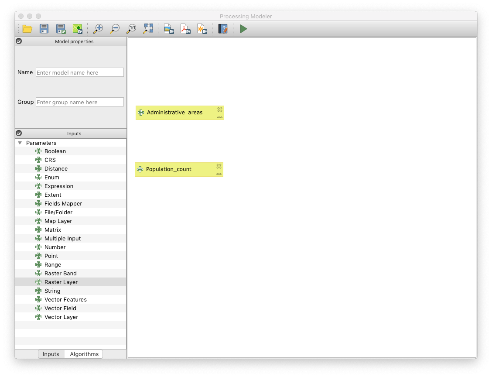

## Adding processing steps

Now that you defined what goes into your model, you want to do something with the inputs. In our scenario we need to first calculate the population per region, then we want to normalise the population count by region area size.

### Calculating population per region

To calculate the population sum per region we can use the sum of all pixels within the region, using the _Zonal statistics_ tool.

- Add the _Zonal statistics_ algorithm to the workspace from the _Algorithms_ tab
- Configure it as follows:

Field  |  Value
--|--
Raster layer  |  Population_count
Raster band  |  1
Vector layer containing zones  |  Administrative_areas
Output column prefix  |  stats_
Statistics to calculate  |  Sum

Here is a screenshot of how your _zonal statistics_ configuration should look like.

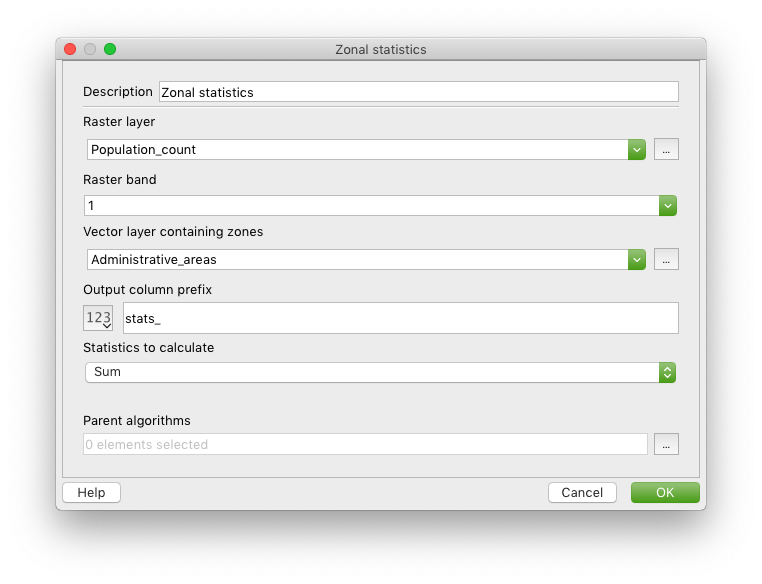

Your workspace should look like below now

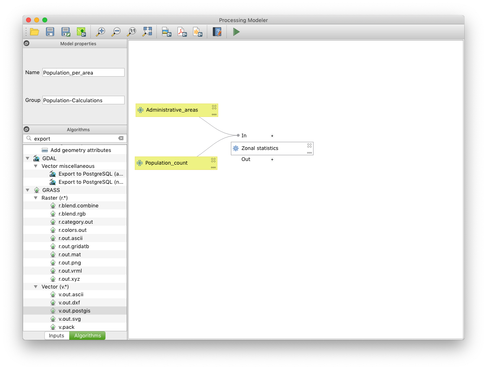

### Normalising the population count

To make the population count a bit more meaningful we will put it into relation to the area. For this we need to first calculate the area size with the _Add geometry attributes_ tool, then we calculate the population densite with the _Field calculator_.

#### Adding the geometry attributes

This step adds attributes to each feature in a vector layer with values for perimeter, area, length, etc (depending on the type of geometry).

- Search for _Add geometry attributes_ in the _Algorithms_ tab and add it to the workspace
- Set the _Input layer_ to _'Zonal statistics' from algorithm 'Zonal statistics'_ - defining the input layer in the algorithm configuration is generally how you chain algorithm, you won't be able to directly change the connectors in the workspace
- Set _Calculate using_ to _Ellipsoidal_ so that values are calculated in metric units (as opposed to degrees)

Below is how your _Add geometry attributes_ configuration should look like

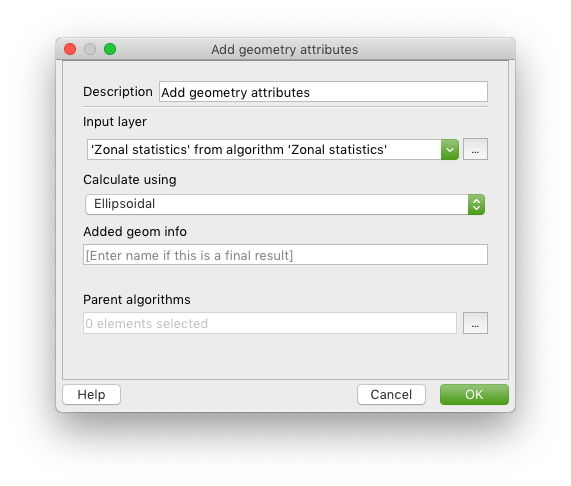

Your workspace should now look like below

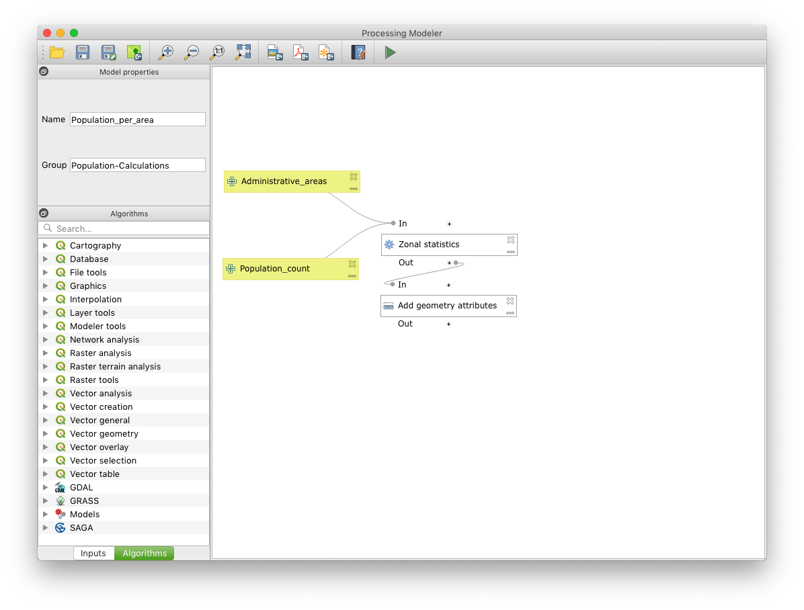

#### Calculating the population density

In this step we will divide the population sum for each region by the region's area size to get the population density.

- Search for _Field calculator_ in the _Algorithms_ tab and add it to the workspace
- Set the fields to the following values

Field  |  Value |  Explanation
--|---|--
Input layer  | 'Added geom info' from algorithm 'Add geometry attributes'  |  
Result field name  | Proportional_sum  |  
Field type  | Float  |  
Field length  | 10  |  
Field precision  | 3  |  
Create new field | Yes  |  
Formular  | "stats_sum" / ("area" / 1000000)  |  Note that attribute names from a layer need to be in double quotes; dividing by 1,000,000 converts the m2 value to km2
Calculated  |  population_per_area |  This defines a final output for the model which will by default be stored in a temporary layer, but can also be saved in an external file when executing the model

This is how your _Field calculator_ configuration should look like:

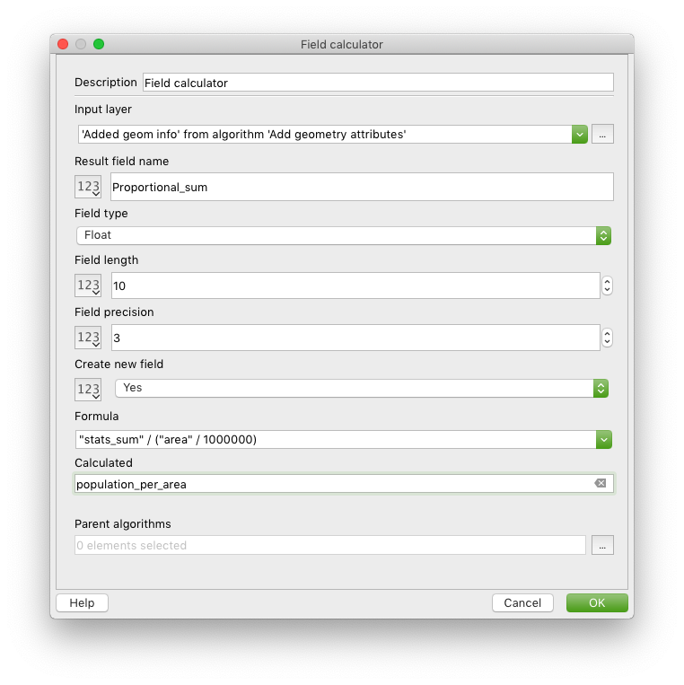

And your complete workspace should look similar to this:

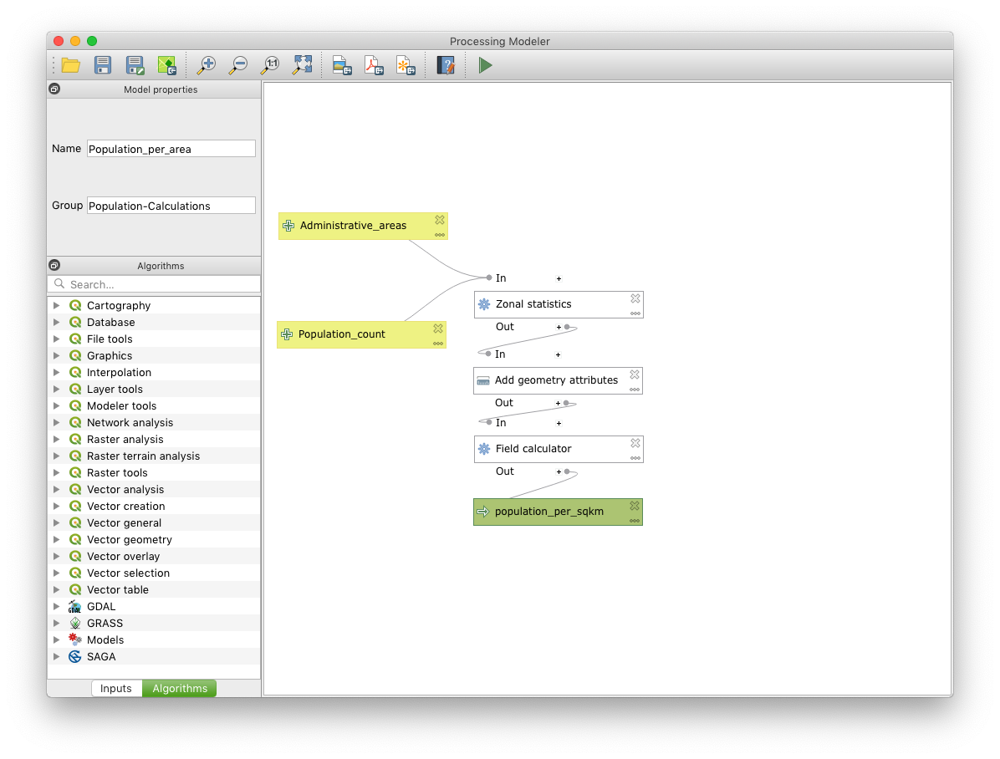

## Storing your model

Your model is now complete. As a final step you need to store it.

- Give your model a name in your top left corner, for example _Population_per_area_
- Define a group, for example _Population-Calculations_. This will aggregate the models into logical groups in your toolbox when you access it later.
- Press _Save model_ in the menu bar and save it in a location of your choice (the default location is fine)

## Running your model

After saving you can access your model by

- going into your QGIS toolbox under _Models_ - _&lt;your-group-name&gt;_ - _&lt;your-model-name&gt;_
- the play button on the far right of the menu bar in the Processing Modeler editor

A window will open, asking you for your inputs:

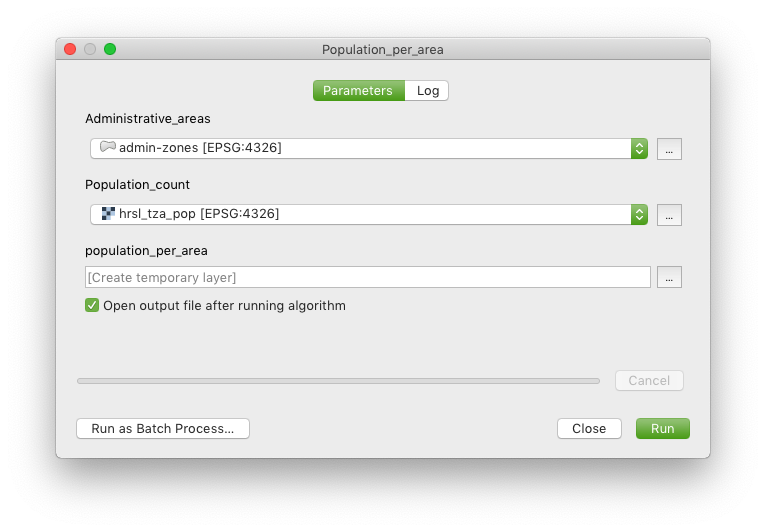

- For _Administrative_areas_ you select your exported admin zone layer (not the original GeoJSON)
- For _Population_count_ you select the raster hrsl_tza_pop
- You can leave _population_per_area_ to its default or change it to save directly to a file for example

Click on _run_ to kick off the model. A log will be shown that brings up any errors and process messages. When the process finished the output will be added to your map.

To make your map more meaningful you can colour the regions in based on their population density:
Right-click on the result layer (population_per_area), go to the symbology tab and set it to:

Field  |  Value
--|--
Symbol type  |  Graduated
Column  |  Proportional_sum
Mode  |  Natural Breaks (Jenks)
Classes  |  10

Below is a screenshot of how the settings should look like:

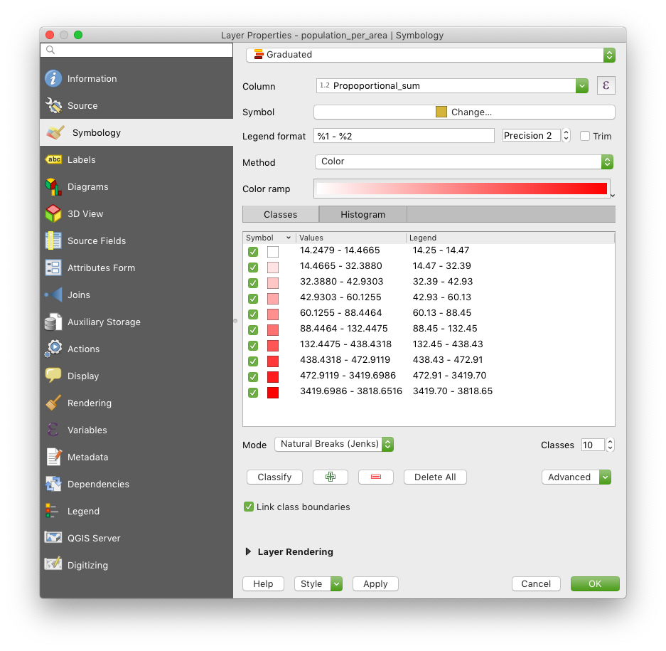

Press _Classify_

You should then get a map similar to the one below (depending on which colour ramp you chose)

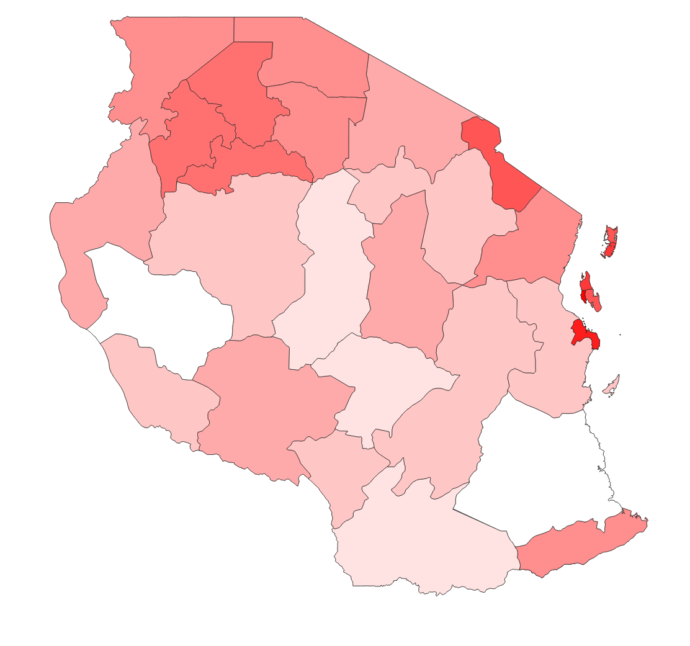

Note that the process will fail when you run it multiple times on the same layer as the geometry attributes and zonal statistics are added in place to the input layer.

# Pitfalls and alternatives

## Lack of documentation

Even though many of the algorithms of the toolbox are the same in the processing modeler, the way parameters and inputs are configured is different. Oftentimes the fields from a layer are not available for example, therefore they have to be typed in manually. In other cases the syntax for inputting formulas is not really clear, so it ends up in a few trial-and-error loops until the desired output is achieved. The documentation for the processing modeler is a bit sparse.

## Processing speed

This is more of a general limitation of QGIS than of the processing modeler specifically, but you should be aware that processing very large data inputs might take a very long time. I was running a join across multiple layers that sit in PostGIS for example which took more than a day to run. The same process with indexes in PostGIS run directly as an SQL query took only 1.5 minutes.

## Alternatives

An alternative would be to run a python script for the processing,  but this would only help people who can code and therefore exclude quite a few users. From a user-friendliness and feature perspective FME is an obvious contender, but comes at a price. Lastly, as mentioned in the previous paragraph it might be more efficient to run your process directly in the database, but again, this requires SQL knowledge and might be more difficult to model.

# Summary

The processing modeler is a great tool to model complex routines that you will run multiple times, or need to refine over time. It comes with some limitations in terms of processing speed and lack of documentation which can sometimes be a bit frustrating. Nevertheless, it can be very useful once you have a working model that you can from then on run again and again in a fraction of the time it would take you to manually run all processing steps.

Let us know your thoughts below, or if you need support with transforming your processing steps into QGIS's processing modeler, feel free to [sign up as a Geovation member](https://geovation.uk/membership/) (free for individuals) and we're happy to help you in one of our surgeries.
